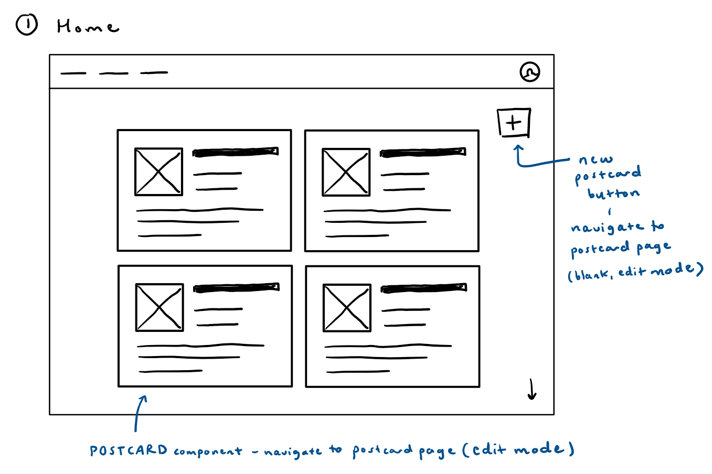
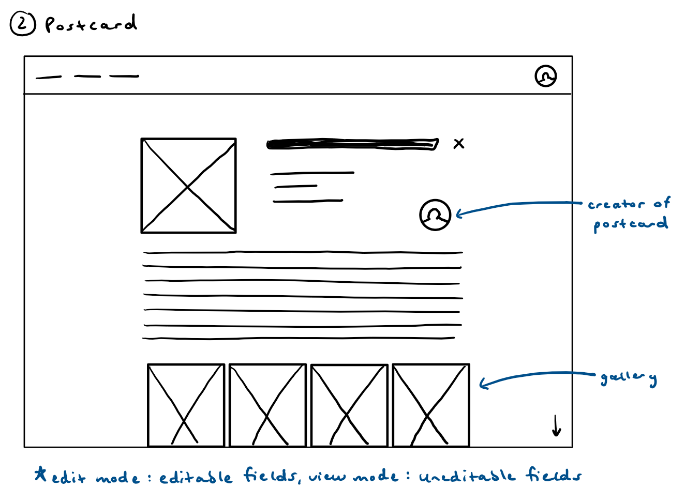
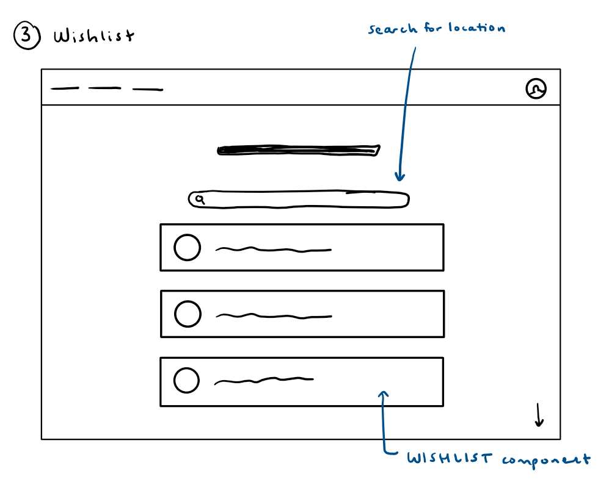
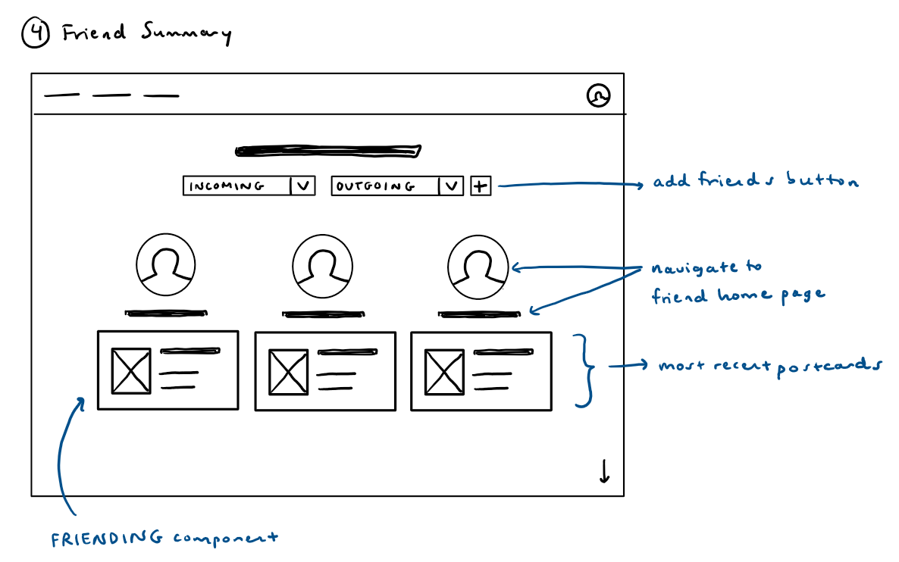
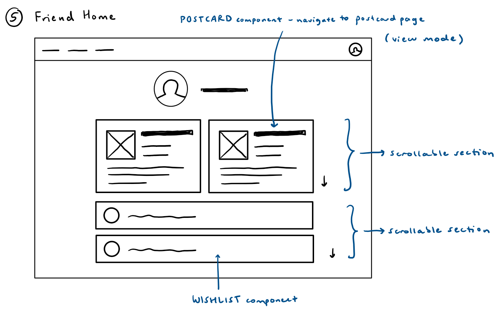

# Assignment 2: Functional Design

## Problem Statement

<!-- #TODO - make this whole part better; and shorter? (cut out deliverables, etc.) -->

### Problem Domain

<!-- A problem domain, with a title and a few sentences explaining it. Remember that a domain is not a particular problem but an area of activity that you are involved or interested in. Your explanation should include what your connection is and why you care about it. (See examples in the first assignment.) -->

**Traveling** - My chosen domain is traveling. Some of my happiest memories have been on trips away from home: I love going to new places to see the sights, try local foods, and broaden my cultural experiences. Furthermore, now that I'm an independent college student and have started making my own money, the possiblities of trips abroad and across the country have opened up, and I have  many travel dreams for the future.

### Problem

<!-- A problem: one key problem faced by users within this domain, with a title and a few sentences explaining it. Remember that a problem must be a difficulty experienced in the problem domain by users; it should not be a flaw or limitation of existing solutions. -->

**Trip Recording** - My chosen problem is recording trips that a user has taken. I personally traveled abroad for the first time this past summer for a MISTI opportunity in the UK, and I also visited the Netherlands, Denmark, and Wales. While I love taking pictures and journaling about my experiences away from home, I don't have a centralized way to remember or share where I've been to and the memories that I made there. Similarly, users will find that the travel experiences that they've gained throughout their lives often only exist in their minds, and both past and hopeful trips have nowhere to be documented.

### Stakeholders

<!-- A stakeholder list, with a name for each kind of stakeholder, and a sentence explaining their role (if any) in the problem. -->

- Traveler - The Traveler is someone who wishes to track their travels and benefits from creating a digital documentation of memories.
- Partner - The Partner is someone who usually accompanies the Traveler on their trips and benefits from the Traveler preserving their shared memories.
- Friend - The Friend is someone who digitally follows along with the Traveler's adventures, allowing them to share their experiences, and who may also enjoy posting their own trips.
- Developer - The Developer has stake in another travel recording app and is harmed by the competition of users choosing this digital travel tracking solution over theirs.

### Evidence & Comparables

<!-- Evidence and comparables: a list of pieces of evidence that the problem is real, which will likely be citations of publicly available resources (but could also be observations that you have made about the extent or nature of the problem), and some comparables, being applications that address this or a related problem. Your list of evidence and comparables should have at least 5 entries, each with a title, an optional link, and a sentence or two explaining it. -->

**Evidence:**
1. [Over 70% of Americans travel annually](https://www.statista.com/chart/31152/share-of-us-respondents-who-have-taken-private-trips/): A study of over 10,000 US participants found that 70% had gone on a personal trip in the past year.
<!-- 2. [Over 70% of Americans post vacation photos](https://www.travelresearchonline.com/blog/index.php/2023/02/the-impact-of-social-media-on-travel-uncovering-the-statistics/#:~:text=Travelers%20love%20to%20share%20their,writing%20hotel%20and%20restaurant%20reviews.): A study found that 72% of Americans share their vacation photos on social media, while 38% blog on social media about their travel desires. -->
2. [Travel dominates Americans' bucket lists](https://www.provisionliving.com/blog/survey-reveals-whats-on-americas-bucket-list/#:~:text=What%20America's%20Bucket%20List%20Looks,law%20and%20trying%20online%20dating.): A survey looking at bucket lists of US respondents found that the most common item was something travel-related, with 77% of respondents including travels.
3. [The travel and tourism app market is increasing](https://market.us/report/travel-and-tourism-apps-market/#:~:text=Key%20Takeaways,guides%2C%20and%20offering%20local%20recommendations.): The travel and tourism app market has an estimated compound annual growth rate of 18.5% from 2025-2034, reaching a total of 3,552.7 billion USD in 2034.
<!-- 2. [Why we should record travel moments](https://www.bbc.com/travel/article/20230209-why-we-should-record-travel-moments)
4. [People dislike hearing about others' travels](https://www.vox.com/the-goods/2018/10/18/17994238/vacation-travel-stories-boring): -->

**Comparables:**
1. [Google Maps](https://www.google.com/maps): Google Maps is a popular app for navigation and searching while traveling. While it allows users to save places and log their travel history on their timeline, that isn't the app's primary focus, and these features don't create a simple or cohesive travel record.
2. [Polarsteps](https://www.polarsteps.com/): Polarsteps is a widely-used travel social media app, in which users can automatically track and also share all the details of their trips, including the planning stage. However, it becomes overcomplicated by implementing features such as automatic route-tracking and accomodation documentation, and it's geared more at adventurers than the common traveler.
<!-- 3. [TravelBoast](https://travelboast.com/#/) - TravelBoast allows you to connect any GPS app to create a log of your trips, complete with details and photos. However, it's very map-based and has some other complicated features, like creating trip animations. -->
3. [Everpin - Private Map Journal](https://apps.apple.com/us/app/everpin-private-map-journal/id640480131): Everpin is a simple, iOS-only app that allows you to track and pin the locations you've visited. However, it has a basic UI and is completely private, so there's no sharing with friends.
<!-- 4. [Journalfy - Travel Journal App](https://journalfy.co/pages/about-the-journalfy-travel-journal-app): Journalfy is a mobile app that allows you to create trips and then add journal entries to each. However, the brand is more focused on journaling as a whole, providing physical notebooks and writing prompts.
5. [Places Been](https://play.google.com/store/apps/details?id=net.myarx.placesbeen&hl=en_US): Places Been is a mobile app that lets you track your travels with a map feature, bucket list, and statistics. However, it has a very simple UI, and it doesn't allow for sharing with friends. -->

## Application Pitch

<!-- Construct a succinct but compelling pitch that explains, in terms understandable to a lay user, how your application will solve the problem. Your pitch should be around half a page in length, and should include the following deliverables:

A name: pick a fun and memorable name for your application.
A motivation: summarize the problem that your application will solve in a sentence.
Key features: explain up to three features in a brief narrative, ensuring that each has a name and a simple explanation of what the feature is; why it helps mitigate the problem; and how it impacts stakeholders. (See the note in the advice section on concepts vs. features.) -->

**Away**: Away is a web application that lets users document and share their past trips and future travel aspirations with friends.

- **Postcards** - Postcards are the posts that a user creates about their travels, including details of the trip title, location, dates, its description, and related photos. Postcards allow users to not only record the places that they've been but also to archive details of their trips, from specific memories to favorite selfies and nature photos. In terms of stakeholders, Postcards allow the Traveler to document trips for their and their Partner's sake, and these travel details are also viewable by the Friend. However, Postcards generate competitive content and engagment that hurts the Developer.

- **Wishlist** - Each user has a Wishlish to which they can add places that they'd like to travel to in the future. The Wishlist allows the user to keep track of their travel aspirations in a central place for future reference. Regarding stakeholders, this feature gives the Traveler the opportunity to record a set of hopeful travel destinations (which the Partner may also share), and it allows Friends to view and take inspiration from the Traveler's wishes. However, as the Traveler fulfills their wishlist trips, they'll likely continue using Away over the Developer's app.

- **Friends** - Users can befriend other users to view one another's postcards and wishlist. This addresses the problem by allowing users to share their travels with friends; both for future reference on trips that they took together and to simply see what the other has been up to. Finally, this impacts stakeholders because the Traveler is able to share their content (which the Partner also took part in), and the Friend is able to view the content; however, the Developer suffers from too many Friends becoming involved with Away over their app.

## Concept Design

<!-- Design a set of concepts that will embody the functionality of your app and deliver its features. We expect you to have 3-5 concepts. Fewer than 3 concepts would probably mean limited functionality or a lack of separation of concerns; more than 5 likely suggests overambition or lack of focus. (Talk to us if you think you need more!) The deliverables are:
The concept specifications, written in the standard form.
-->

### 1) User Authentication

**concept** UserAuthentication

**purpose** limits access to registered users

**principle** after a user registers with a username and a password, they can authenticate with that same username and password to be handled as the same user each time

**state**

&nbsp; a set of Users with \
&nbsp;&nbsp;&nbsp; a username String \
&nbsp;&nbsp;&nbsp; a password String

**actions**

&nbsp; register(username: String, password: String): (user: User) \
&nbsp;&nbsp;&nbsp; **requires** username doesn't exist among set of users \
&nbsp;&nbsp;&nbsp; **effects** creates and returns a new user with given username and password

&nbsp; authenticate(username: String, password: String): (user: User) \
&nbsp;&nbsp;&nbsp; **requires** username matches a user with the given password

### 2) Friending

**concept** Friending [User]

**purpose** allows users to share special permissions with other users

**principle** after a user requests to be another user's friend, that user can accept to create a friendship; the friendship can then be validated for mutual, special permissions between the friends; if at any point in the process one of the friends ends the friendship, all special permissions are lost between the users

**state**

&nbsp; a set of Users with \
&nbsp;&nbsp;&nbsp; an outgoingFriendRequests set of Users \
&nbsp;&nbsp;&nbsp; an incomingFriendRequests set of Users \
&nbsp;&nbsp;&nbsp; a friends set of Users

**actions**

&nbsp; requestFriend(user: User, friend: User) \
&nbsp;&nbsp;&nbsp; **requires**  friend is not already in user's set of outgoing friend requests, incoming friend requests, or friends; friend does not equal user  \
&nbsp;&nbsp;&nbsp; **effects** adds friend to user's set of outgoing friend requests and adds user to friend's set of incoming friend requests

&nbsp; acceptFriend(user: User, friend: User) \
&nbsp;&nbsp;&nbsp; **requires** friend exists in user's set of incoming friend requests \
&nbsp;&nbsp;&nbsp; **effects** removes friend from user's set of incoming friend requests and removes user from friend's set of outgoing friend requests; adds friend to user's set of friends and adds user to friend's set of friends

&nbsp; validateFriendship(user: User, friend: User) \
&nbsp;&nbsp;&nbsp; **requires** friend exists in user's set of friends

&nbsp; endFriendship(user: User, friend: User) \
&nbsp;&nbsp;&nbsp; **requires** friend exists in user's set of outgoing friend requests, incoming friend requests, or friends \
&nbsp;&nbsp;&nbsp; **effects** removes friend from user's associated set and removes user from friend's associated set

### 3) Posting

**concept** Posting [User]

**purpose** makes a record of a user's trip

**principle** after a user creates a post about a trip that they took, it becomes part of their personal content, and can then be edited to update details, or later deleted to remove it from their personal content

**state**

&nbsp; a set of Posts with \
&nbsp;&nbsp;&nbsp; a creator User \
&nbsp;&nbsp;&nbsp; a title String \
&nbsp;&nbsp;&nbsp; a city String \
&nbsp;&nbsp;&nbsp; a region String \
&nbsp;&nbsp;&nbsp; a country String \
&nbsp;&nbsp;&nbsp; a start Date \
&nbsp;&nbsp;&nbsp; an end Date \
&nbsp;&nbsp;&nbsp; a description String \
&nbsp;&nbsp;&nbsp; a gallery set of Images
<!-- &nbsp;&nbsp;&nbsp; a public Flag -->

<!-- &nbsp; a set of Places with \
&nbsp;&nbsp;&nbsp; a city String \
&nbsp;&nbsp;&nbsp; a region String \
&nbsp;&nbsp;&nbsp; a country String -->

**actions**

&nbsp; create(creator: User, title: String, city: String, region: String, country: String, start: Date, end: Date, description: String, gallery: set of Images): (post: Post) \
&nbsp;&nbsp;&nbsp; **requires** end date is in the past and comes after start date; and city, region, country is an existing location \
&nbsp;&nbsp;&nbsp; **effects** creates and returns a post associated with the given user, title, city, region, country, start date, end date, description, and gallery

&nbsp; edit(user: User, post: Post, title: String): (post: Post) \
&nbsp;&nbsp;&nbsp; **requires** post exists in set of posts and user is its creator \
&nbsp;&nbsp;&nbsp; **effects** updates post's title and returns post

&nbsp; edit(user: User, post: Post, city: String, region: String, country: String): (post: Post) \
&nbsp;&nbsp;&nbsp; **requires** post exists in set of posts and user is its creator; city, region, country is an existing location \
&nbsp;&nbsp;&nbsp; **effects** updates post's city, region, and country, and returns post

&nbsp; edit(user: User, start: Date): (post: Post) \
&nbsp;&nbsp;&nbsp; **requires** post exists in set of posts and user is its creator; start date comes before end date \
&nbsp;&nbsp;&nbsp; **effects** updates post's start date and returns post

&nbsp; edit(user: User, end: Date): (post: Post) \
&nbsp;&nbsp;&nbsp; **requires** post exists in set of posts and user is its creator; end date comes after start date and is in the past \
&nbsp;&nbsp;&nbsp; **effects** updates post's end date and returns post

<!-- &nbsp; edit(user: User, public: Flag): (post: Post) \
&nbsp;&nbsp;&nbsp; **requires** post exists in set of posts and user is its creator \
&nbsp;&nbsp;&nbsp; **effects** updates posts's private flag to the given setting and returns post -->

&nbsp; delete(user: User, post: Post) \
&nbsp;&nbsp;&nbsp; **requires** post exists in set of posts and user is its creator \
&nbsp;&nbsp;&nbsp; **effects** removes post from set of posts

### 4) Wishlist

**concept** Wishlist [User]

**purpose** keep track of future dream destinations

**principle** after a wishlist is created for a user, the user can add places that they want to travel to, and then remove places that they've already been or no longer want to go

**state**

&nbsp; a set of Wishlists with \
&nbsp;&nbsp;&nbsp; a creator User \
&nbsp;&nbsp;&nbsp; a set of Places
<!-- &nbsp;&nbsp;&nbsp; a public Flag -->

&nbsp; a set of Places with \
&nbsp;&nbsp;&nbsp; a city String \
&nbsp;&nbsp;&nbsp; a region String \
&nbsp;&nbsp;&nbsp; a country String

**actions**

&nbsp; create(user: User): (wishlist: Wishlist) \
&nbsp;&nbsp;&nbsp; **requires** user doesn't exist in the set of wishlists \
&nbsp;&nbsp;&nbsp; **effects** makes and returns a new wishlist asosciated with the given user and an empty set of places

<!-- &nbsp; editVisibility(wishlist: Wishlist, private: Flag): (wishlist: Wishlist) \
&nbsp;&nbsp;&nbsp; **effects** update the wishlist's private flag to the given setting -->

&nbsp; addPlace(wishlist: Wishlist, city: String, region: String, country: String) \
&nbsp;&nbsp;&nbsp; **requires** city, region, country is an existing location, and place with given city, region, and country doesn't exist in wishlist's set of places \
&nbsp;&nbsp;&nbsp; **effects** adds new place associated with given city, region, and country to wishlist's set of places

&nbsp; removePlace(wishlist: Wishlist, city: String, region: String, country: String) \
&nbsp;&nbsp;&nbsp; **requires** place with given city, region, and country exists in the wishlist's set of places \
&nbsp;&nbsp;&nbsp; **effects** removes place associated with given city, region, and country from the wishlist's set of places

<!-- Some essential synchronizations. You do not need an exhaustive collection of synchronizations, but should capture (a) any essential design ideas that involve multiple concepts; (b) representative syncs for kinds of sync that are common throughout your application (such as syncs for access control or notification). -->

### Syncs

**sync** register \
**when** Request.register (username, password) \
&nbsp;&nbsp;&nbsp;&nbsp;&nbsp;&nbsp;&nbsp;&nbsp;&nbsp; UserAuthentication.register (username, password) : (user) \
**then** Wishlist.create (user)

**sync** makePost \
**when** Request.makePost (user, title, city, region, country, start, end, destination, gallery) \
**then** Posting.create (creator: user, title, city, region, country, start, end, destination, gallery)

**sync** addToWishlist \
**when** Request.addToWishlist (city, region, country) \
**then** Wishlist.add (city, region, country)

**sync** addFriend \
**when** Request.addFriend (user, friend) \
**then** Friending.requestFriend (user, friend)

**sync** viewFriendContent \
**when** Request.viewFriendContent (user, friend) \
&nbsp;&nbsp;&nbsp;&nbsp;&nbsp;&nbsp;&nbsp;&nbsp;&nbsp; Friending.validateFriendship (user, friend) \
**where** Posting's state associates a set of posts with user and Wishlist's state associates a wishlist with user
**then** Request.response (posts, wishlist)

<!-- A brief note, at most half a page long, explaining the role that your concepts play in the context of the app as a whole. For example, if you have an authentication or authorization concept, you should say how it’s used to control access to other particular concepts. You should also explain how generic type parameters will be instantiated whenever it’s non obvious. (For example, that a generic user type will be bound to the users of an authentication concept is obvious; that the targeted items of an upvoting concept are users would not be.) -->

### Note

The UserAuthentication concept allows users to login to their personal account, where they will then have access to all of their (and their friends') posts and wishlists; without logging in, a user doesn't have access to any content. These posts are created and managed using the Postcards concept, and the wishlist is similarly updated using the Wishlist concept. Finally, the Friending concept gives users mutual authorization to view one another's postcards and wishlists, which are otherwise private only to the user.

## UI Sketches

## User Journey

A user has recently completed an amazing week-long road trip across the US to end the summer. However, she's worried that she'll soon forget the details of her travels and the states that she visited along the way.

She pulls up the Away app on her laptop, which opens to the Home page with a view of her past postcards. She clicks the "+" button to navigate to the editable Postcard page and begins filling in the form with the corresponding information about the first part of her trip (title: Road Trip Pt. 1, location: Nebraska, dates: 8/15/25 - 8/17/25). She reminisces about her favorite moments as she adds descriptions and photos, and then she completes the post and makes additional postcards for her next few road trip stops.

The user is disappointed that she didn't have the chance to explore Colorado, so she navigates to her Wishlist page, starts typing "Colorado," and selects Colorado from the dropdown that appears in order to add the location to her wishlist. Finally, she decides that she wants to share her travels with her cousin, so she navigates to the Friend Summary page, clicks on the "+" button beside the Incoming and Outgoing requests dropdowns, and types her cousin's username to send a friend request that will soon be accepted. The user is satisfied and relieved that she was able to record the memories from her cross-country trip for herself and others to always look back on.

<!-- ## TODO
- make sure purpose is specific enough
- make sure all critical actions are mentioned in operational principle (Editing, deleting, etc.)
- replace trip with places? because cross-country road trip involves many places but a single trip -->
